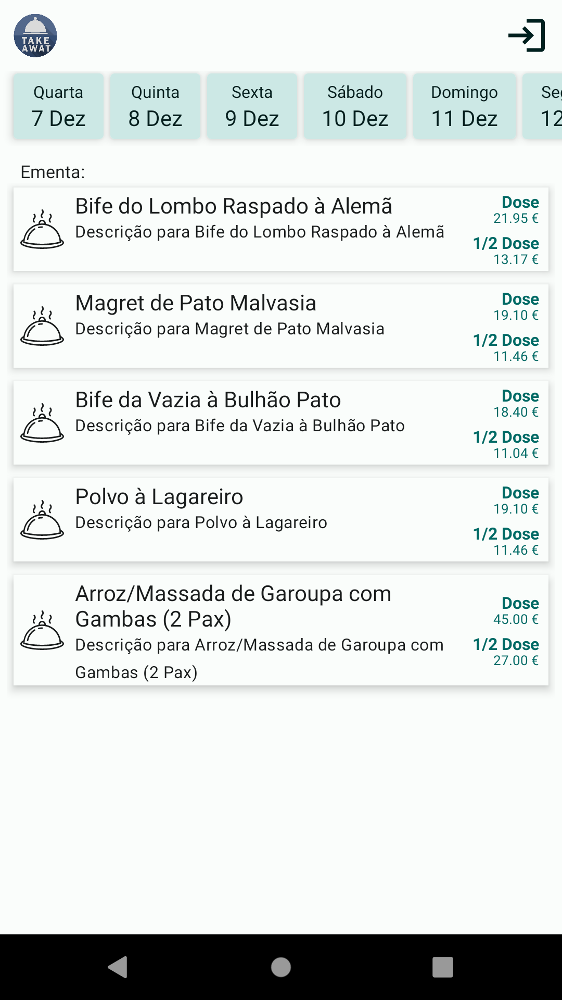
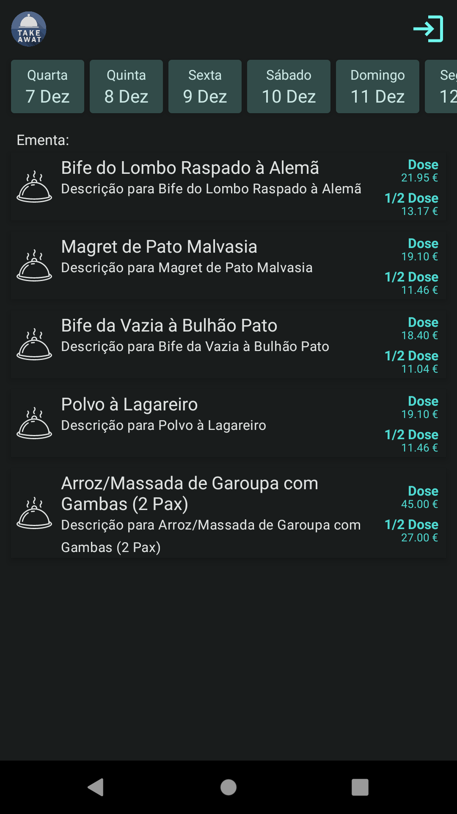
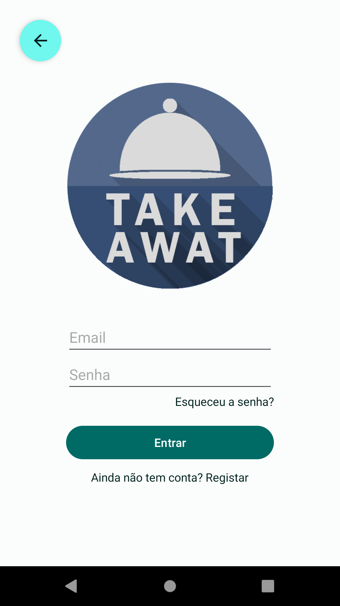
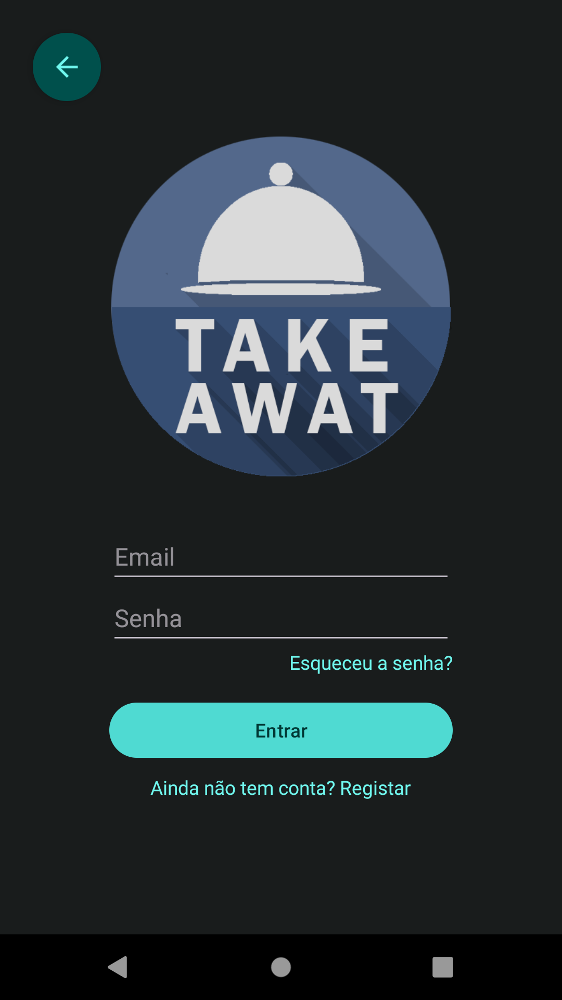

# TakeAwat V2

Este projeto é uma versão reescrita do [TakeAwat](https://github.com/heroslender/TakeAwat), mas
desta vez usando kotlin como linguagem base e uma versão mais recente do android sdk.

### Current UI

#### Menu list

Light Theme                |  Dark Theme
:-------------------------:|:-------------------------:
  |  

#### Login

Light Theme                |  Dark Theme
:-------------------------:|:-------------------------:
 | 
